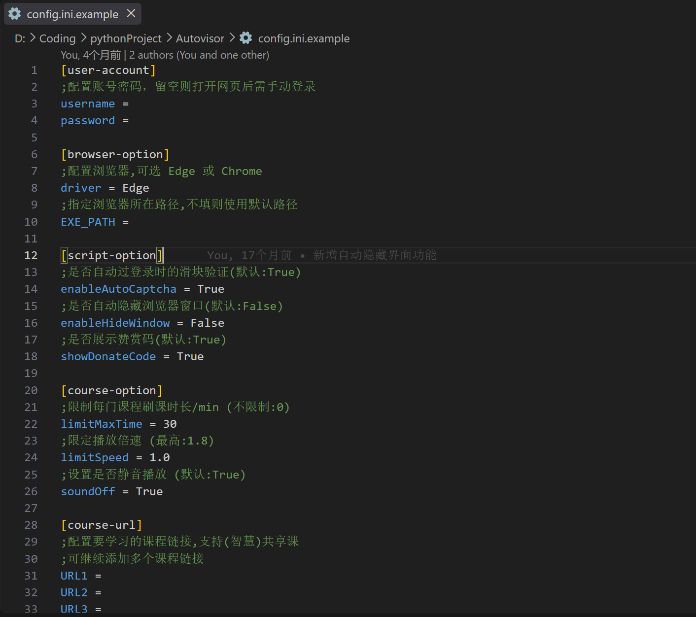
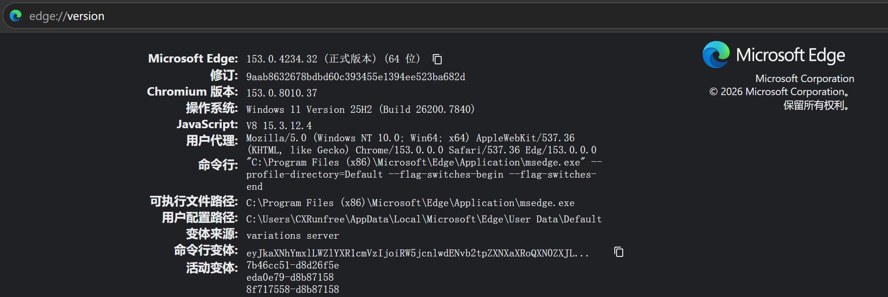

##  Autovisor

**Github项目主页：**[CXRunfree/Autovisor](https://github.com/CXRunfree/Autovisor)

------
#### 2026/9/15 公告

感谢大家三年多以来的喜爱与支持~

准备读研, 本项目佛系更新

#### 2026/9/19 Autovisor-3.18.3 更新

**本次更新:**

- 修复课程页卡死: 已读的"学前必读"弹窗是隐藏节点, 等它可见会一直等下去, 现在超时即跳过 ([#155](https://github.com/CXRunfree/Autovisor/pull/155)).
- 课时切换、目录识别的等待也加上超时, 异常页面不再长时间卡住.
- 支持 Python 3.13.

**近期更新:**

- 修复检查更新时因 SSL 证书校验失败而误报的问题: 校验失败会自动降级重试, 且只接受可信的下载链接.
- 日志系统重构: 每条日志带时间、级别和代码位置, 关键流程增加事件与运行状态记录, 重复的轮询日志自动折叠; 报错会指明具体是哪个按钮/元素找不到, 方便定位问题.
- 修复登录凭证保存时机: 仅在内容变化时写入, 并在退出时兜底保存, 避免频繁写盘或凭证丢失.
- 修复在非交互环境下因无法读取输入而异常退出的问题.
- 赞赏码改为通过配置项关闭, 不再需要删除文件.

- 新增启动时自动检查更新: 检测到 GitHub Release 有新版本时, 提示当前版本、更新说明与下载地址; 断网或检查失败不影响程序运行.
- 修复清华镜像源因浏览器 User-Agent 被拒绝(403)的问题: 依赖下载统一改用 pip 风格 User-Agent.
- 支持更多课程类型: 智慧共享课新版目录、翻转课及旧版课程, 自动识别页面目录结构.
- 优化完成判定: 检测平台实际进度, 未确认完成时自动回退重试, 避免误跳下一课.
- 视频与平台进度长时间无推进时自动停止, 避免卡死无限循环.
- 安全验证、课中弹题期间暂停播放, 且等待时间不计入课程时限.
- 新增只读诊断命令: `--check-browser` 与 `--check-course`, 不刷课、不下载媒体、不上报进度.
- 新增 macOS 源码运行支持: `run_macos.sh` 一键部署, 首次运行自动安装 `uv`、依赖与必要的浏览器.
- 配置文件改为模板管理: 复制 `config.ini.example` / `config.macos.ini.example` 作为本地配置.
- 修复了限时功能在安全验证期间未暂停计时的问题.
- 修复智慧树新版登录页兼容问题.
- 修复从非项目目录启动时无法读取 `config.ini` 的问题.
- 限制运行环境为 Python 3.10 ~ 3.13.
- 更新运行时依赖下载器, 按 Python、ABI 和系统架构选择匹配的 wheel, 并避免新旧依赖混装.
- 依赖配置升级为 `pyproject.toml`.
- 镜像源移至 `data/mirrors.json`, 支持按顺序切换备用镜像.
- 重整发行版目录, 使用 `resources/`、`packages/` 和 `data/` 分类存放文件.

#### 💗赞助商

| 赞助商 | 简介 |
| :---: | :--- |
| [](https://sourceidea.top/home) | 感谢 **SourceIdea** 对本项目的赞助！[sourceidea.top](https://sourceidea.top/home) 是一个专注稳定、高效与透明的 AI 中转站, 为 Claude、OpenAI、Grok 及国产模型提供快速稳定的中转服务. 可无缝对接 Codex、OpenCode 、Claude Code 等主流编程工具, 以远低于官方的价格获得相同的模型能力.  点击 [此处](https://sourceidea.top/home) 前往注册, 即可获得更快、更稳定、更实惠的 AI API 服务！ |

------
#### 一、程序介绍

**项目简介:**

这是一个可无人监督的自动化程序, 基于微软的 Playwright 框架, 由 Python 和 JavaScript 编写而成. 核心原理是使用浏览器模拟用户操作.

**程序功能:**

- **支持自动登录**
- **自动通过滑块验证(可选)**
- **自动播放和切换下一集**
- **跳过弹窗和弹出的题目**
- **自动静音、调成指定的倍速**
- **检测视频是否暂停并续播**
- **支持刷习惯分**
- **支持智慧共享课**
- **支持翻转课**
- 检测当前学习进度并后台实时更新
- 根据当前时间自动设置背景颜色(白天/夜晚)
- 完成章节时将提示已刷课时长
- 各种自定义配置

#### 二、使用须知

1. 请确保系统为 Windows 10 及以上.

2. 准备配置文件:

   - **发行版**: 文件夹内自带 **config.ini** (可能没显示 `.ini` 后缀名);
   - **源码运行**: 先将模板复制为本地配置再编辑:

   ```bash
   copy config.ini.example config.ini
   ```

3. 填写配置文件:

   - 默认启动 Edge 浏览器;
   - 文件里的 **EXE_PATH 项** 用于自定义浏览器路径, 但必须精确到**浏览器可执行文件的位置**;
   - 不知道浏览器的安装路径? 见下方 **五、常见问题**.

4. 根据文件内的说明填写好配置信息, 一定要**保存后**再退出.

   **注意: `config.ini` 配置项不需要加引号. 镜像源请编辑 `data/mirrors.json`, 必须遵循 JSON 格式.**

   <p align="left"></p>

5. 运行 **Autovisor.exe**, 会自动打开浏览器, 进入网课界面后就能自动刷课了!

   (如果未设置 **enableAutoCaptcha=True**, 则需要**手动完成**登录时的滑块验证)

**发行版目录说明:**

- `resources/`: 图片、脚本等程序资源.
- `packages/`: 自动下载的 NumPy、OpenCV 等运行时依赖.
- `data/`: 登录 Cookies 和镜像源配置.

#### 三、macOS 源码运行

需要 macOS 和系统 Chrome. 先复制模板并填写配置:

```bash
cp config.macos.ini.example config.macos.ini
```

打开 `config.macos.ini`, 填入课程链接 (账号密码可留空, 用浏览器手动登录), 然后运行:

```bash
./run_macos.sh
```

首次运行会自动部署环境 (安装 `uv`、依赖和必要的浏览器), 之后直接启动. 环境或配置变化时会自动重新部署, 也可用 `./run_macos.sh --setup` 强制重建.

#### 四、发行版下载

- Github: [Releases · CXRunfree/Autovisor](https://github.com/CXRunfree/Autovisor/releases)
- 网盘备用: [蓝奏云 · Autovisor-for-windows](https://wwk.lanzouj.com/b05evsxif) 密码: 492l

这是已经打包好的程序, 若需要**源代码**请于 Github 项目主页下载.

#### 五、常见问题

1. 为什么解压后没有 Autovisor.exe / 运行报错**缺失依赖文件**?

   - 可能是被杀毒软件误杀了, 考虑暂时关闭杀毒软件.

2. 为什么会出现一个命令行黑框?

   - 这是程序运行的后台, 你可以查看当前运行的状态.

3. 为什么第一次启动就失败了?

   - 首次启动会检查并下载运行时依赖, 请等待后台日志完成. 如果下载失败, 程序会自动尝试 `data/mirrors.json` 中的下一个镜像源.

4. 为什么运行程序只出现后台却没出现浏览器界面?

   - 加载需要时间, 只要后台未异常退出就不必担心; 如果报错可能是你的浏览器安装路径有问题.

5. 我想自定义要启动的浏览器, 但是找不到装在哪里?

   - 打开你的浏览器, 在地址栏中输入 `chrome://version` 回车之后, 如图的"可执行文件目录"就是浏览器安装目录了.

   <p align="left"></p>

6. 关于弹题关不掉 / 程序卡住的问题:

   - 因为弹题是时刻有可能发生的, 而弹题检测不是时刻都进行, 所以这个问题不能完全消除;
   - 程序使用异步任务进行答题检测. 如果页面长时间没有响应, 请先确认浏览器没有被最小化.

7. 我已经打赏过了, 不希望再弹赞赏码怎么办?

   - 感谢您对本项目的支持~ 只需要设置 `showDonateCode = False` 就好了!

------
#### 已知问题

- **长时间挂机**有概率弹出人机验证, 程序检测到后会暂停操作, 直到手动验证完成;
- 浏览器窗口若**最小化**可能导致视频播放进度不增加;
- 若出现其他异常崩溃, 请提交 issue 并附上报错信息.

#### 写在最后

觉得体验还不错? 请留下你宝贵的 Star ⭐, 并分享给更多有需要的人!

或者为项目发电支持一下~

<p align="left"></p>

**作者的 CSDN:** [欢迎关注~](https://blog.csdn.net/Runfreeone)

**声明：本程序只可用于学习和研究计算机原理, 请于 24h 内删除所有存档！**
